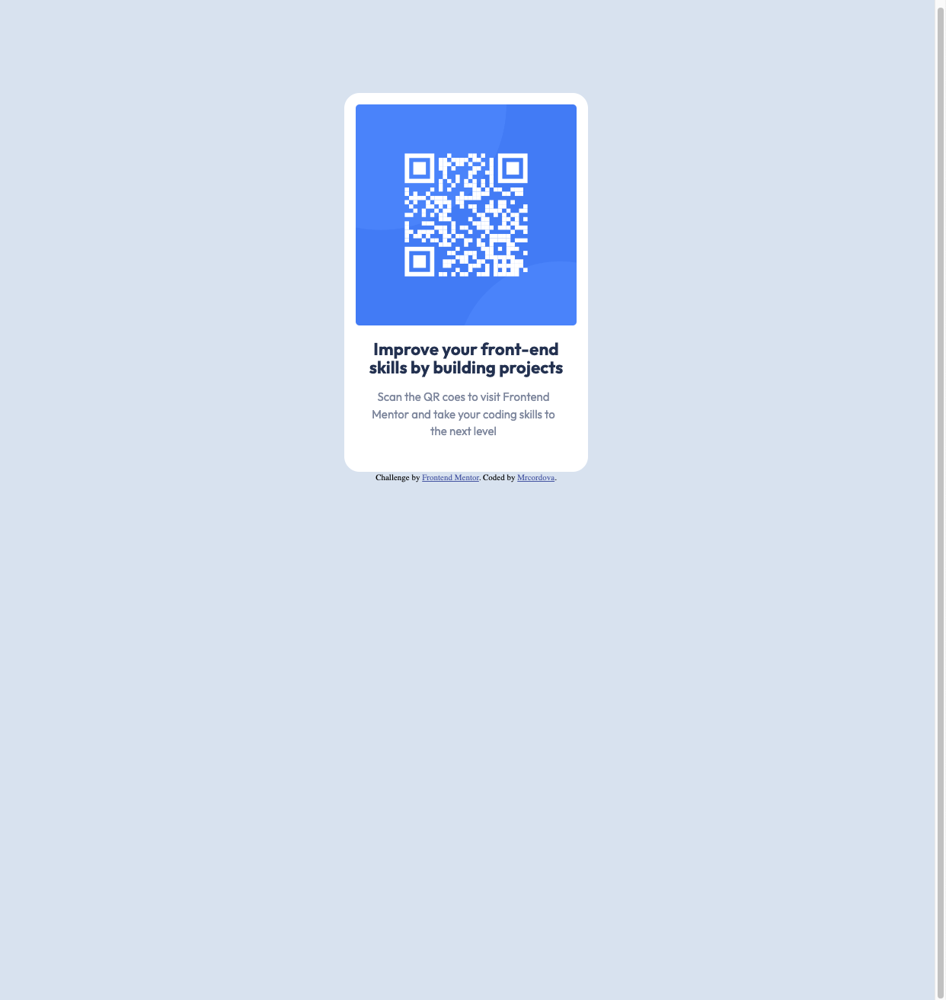

# Frontend Mentor - QR code component solution

This is a solution to the [QR code component challenge on Frontend Mentor](https://www.frontendmentor.io/challenges/qr-code-component-iux_sIO_H). Frontend Mentor challenges help you improve your coding skills by building realistic projects.

## Table of contents

- [Overview](#overview)
  - [Screenshot](#screenshot)
  - [Links](#links)
- [My process](#my-process)
  - [Built with](#built-with)
  - [Continued development](#continued-development)
  - [Useful resources](#useful-resources)
- [Author](#author)

**Note: Delete this note and update the table of contents based on what sections you keep.**

## Overview

### Screenshot

### Links

- Solution URL: [mrcordove's repo](https://github.com/mrcordova/qr-code-component)
- Live Site URL: [live website](https://mrcordova.github.io/qr-code-component/)

## My process

### Built with

- Semantic HTML5 markup
- CSS custom properties

### Continued development

I would like to work on aligning elements. I had trouble on how to align the card relative to the body.

### Useful resources

- [MDN margin](https://developer.mozilla.org/en-US/docs/Web/CSS/margin) - This helped me center the card horizontally.
- [MDN padding](https://developer.mozilla.org/en-US/docs/Web/CSS/padding) - This helped me how to put space between a parent element and its child element.

## Author

- Website - [mrcordova](https://github.com/mrcordova)
- Frontend Mentor - [@mrcordova](https://www.frontendmentor.io/profile/mrcordova)
